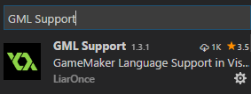

# GML Support

GameMaker Language 对 Visual Studio Code 的支持。

Visual Studio Code版本需高于1.8.0。

## 开始

在 Visual Studio Code 中直接搜索安装，重新加载即可。

## 依赖

本插件需要 [`vscode-icons`](https://github.com/vscode-icons/vscode-icons) 和 [`Shader languages support for VS Code`](https://github.com/stef-levesque/vscode-shader)，这些将在本插件安装时自动安装。

## 任务

* [ ] 完善 GameMaker:Studio 的代码片段（现在完成大约 75% ）
* [ ] 完善 GameMaker 8.1 的代码片段（现在完成大约 55% ）
* [ ] Language Server
* [ ] 调试器

## Q&A

> 1, 为什么移除了函数信息

因为我认为在代码片段上显示函数信息的效果很不好，我想在制作出语言服务器之后再进行实现，所以从 1.3.3 开始移除代码片段中的函数信息。

## 注意

以下为用法在8.0翻译文档中不完整的函数：

display_reset(AA) Resets the display settings to the ones when the program was started, and also allow you to change the current level of Full Screen Anti-Aliasing being used. Available levels are 0,2,4 and 8. GameMaker start up with 0.

display_aa This read-only variable will report the various levels of AA that a users machine can display. It will do this by setting bits for the different levels, so for only 2xAA, this will report 2, for 2x and 4x availablility it will report 6. For 8 and 4 it will report 12. For all 3 levels (2,4 and 8) it will report 14. To allow a user to set AA, use something like the code shown below.. 

if( display_aa&2 ) display_reset(2);

在游戏绘制——高级绘制函数中的函数（这些函数将在后续版本中添加）：

sprite_get_texture(spr,subimg) 返回纹理id对应于精灵子图。

background_get_texture(back) 返回纹理id对应于背景。

.gmk和.gm81文件是GameMaker 8.1的项目文件。   
这些文件无法被文本编辑器编辑。   
在这里仅仅只是为了区分版本。